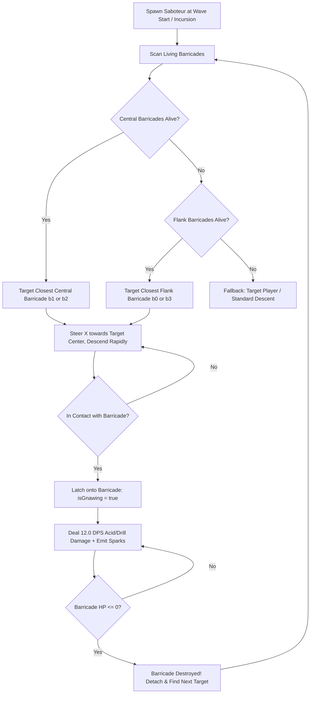

# Survey Report: Requirement R3 — Barricade Saboteurs & Repair Mechanics

**Working Directory**: `/Users/user/src/water-invader/.agents/teamwork_preview_explorer_survey_barricades_repair/`  
**Target Milestone**: R3 (Barricade Saboteurs & Repair Mechanics)  
**Synergy Milestones**: R2 (Allied Reinforcements with Roles & UI)  
**Date**: 2026-09-03 / 2026-09-04  
**Author**: Explorer (Teamwork Investigation Specialist)  

---

## Executive Summary

Requirement R3 mandates two tightly coupled gameplay mechanics:
1. **Barricade Saboteur Enemy**: A specialized enemy type that specifically seeks out, homes in on, and gnaws away at the central defensive barricades protecting the player.
2. **Defensive Repair & Restoration**: To counter this threat, the defensive barricades must either automatically fully restore at the start of every new wave, or Allied Repair Bots (from R2) must actively prioritize repairing damaged barricades back to full health during combat.

Our comprehensive inspection of the codebase reveals that:
- The game already has a clean voxel-based barricade representation (`src/game/Barricade.ts`), where 4 barricades sit at $y = \text{logicalHeight} - 150$: the outer two are destructible ice (`#38bdf8`), and the inner two are indestructible stone cover (`#94a3b8`).
- **Critical Architectural Gaps Discovered**:
  1. `spawnBarricades()` is **never called during wave transitions** (`startNextWave()`), meaning barricade degradation/destruction currently persists permanently across all subsequent waves.
  2. `Barricade.update()` only contains code to *destroy* voxel blocks when HP drops, but **completely lacks reverse logic to reconstruct voxel blocks when HP is healed/repaired**.
  3. Indestructible stone barricades take 0 damage from normal enemies and bullets, so the **Barricade Saboteur** must be granted the unique ability to erode fortification integrity.
  4. An existing `HelperType.REPAIRER` exists in `Helper.ts`, but its repair logic needs enhancement and seamless synchronization with R2's Allied Reinforcement system and `Barricade` voxel blocks.

We provide a complete, verified architectural design that delivers **both** wave-start full restoration and active Repair Bot barricade maintenance, along with exact enemy AI pathing, stats, procedural vector art specifications, and Playwright verification test suites.

---

## 1. Current Barricade Implementation Analysis

### 1.1 Source Files & Class Hierarchy
- `src/game/Barricade.ts`: Defines `BarricadeType` and `Barricade` entity class.
- `src/game/Entity.ts`: Base class providing `position`, `size`, `color`, `isDead`, and AABB `checkCollision(other)`.
- `src/game/types.ts`: Core type definitions (`Vector2D`, `Size`, `Rect`, `Faction`, `EnemyType`).
- `src/game/GameManager.ts`: Lifecycle management (`spawnBarricades()`, `checkCollisions()`, update and draw loops).
- `src/game/Bullet.ts`: Projectile collisions (`ignoreBarricades: boolean`).
- `src/game/Helper.ts`: Allied support units including `HelperType.REPAIRER`.

### 1.2 Data Representation & Voxel Block Structure
```typescript
export enum BarricadeType {
  DESTRUCTIBLE,   // 0: Ice cover (Sky blue #38bdf8)
  INDESTRUCTIBLE  // 1: Stone cover (Slate #94a3b8)
}

export class Barricade extends Entity {
  public hp: number;
  public maxHp: number;
  public type: BarricadeType;
  
  // Voxel-based destruction grid: 6 columns x 4 rows = 24 blocks
  private cols = 6;
  private rows = 4;
  public blocks: boolean[]; // Array of 24 booleans
...
```
- **Dimensions**: `width = 60px`, `height = 40px`.
- **Grid Resolution**: 6 columns $\times$ 4 rows = 24 individual sub-blocks. Each sub-block is $10\text{px} \times 10\text{px}$.
- **Rendering**: In `Barricade.draw()`, each surviving `blocks[i] === true` is rendered with `ctx.fillRect()`.

### 1.3 Spatial Layout & Positioning
In `src/game/GameManager.ts` (`spawnBarricades()`, lines 255–266):
```typescript
  private spawnBarricades() {
    this.barricades = [];
    const padding = 150;
    const startX = (this.logicalWidth - (3 * padding + 60)) / 2;
    const y = this.logicalHeight - 150;
    
    this.barricades.push(new Barricade(startX, y, BarricadeType.DESTRUCTIBLE));
    this.barricades.push(new Barricade(startX + padding, y, BarricadeType.INDESTRUCTIBLE));
    this.barricades.push(new Barricade(startX + padding * 2, y, BarricadeType.INDESTRUCTIBLE));
    this.barricades.push(new Barricade(startX + padding * 3, y, BarricadeType.DESTRUCTIBLE));
  }
```
In a standard $720 \times 960$ canvas:
- $y = 960 - 150 = 810\text{px}$.
- The player ship is located at $y \approx 900\text{px}$ (`logicalHeight - 60`).
- The 4 barricades sit in a defensive horizontal defensive wall directly shielding the player:
  - **Barricade 0**: Outer Left Flank ($x \approx 105$) — Destructible Ice (`hp = 20`)
  - **Barricade 1**: Central Left ($x \approx 255$) — Indestructible Stone Cover (`type = 1`)
  - **Barricade 2**: Central Right ($x \approx 405$) — Indestructible Stone Cover (`type = 1`)
  - **Barricade 3**: Outer Right Flank ($x \approx 555$) — Destructible Ice (`hp = 20`)

**Key Architectural Insight**:
The **central barricades** (`barricades[1]` and `barricades[2]`) form the player's primary, high-value defensive bunker. Under normal circumstances, standard enemy bullets and standard invaders cannot destroy them. The introduction of the **Barricade Saboteur** fundamentally disrupts the player's safe zone by targeting and eroding these central anchors.

### 1.4 Current Collision & Damage Mechanics
1. **Bullet vs Barricades** (`GameManager.ts`, lines 1539–1557):
   - Bullets without `ignoreBarricades` check AABB collision against each barricade.
   - If `barricade.type === BarricadeType.DESTRUCTIBLE`: `barricade.hp -= bullet.damage`. The bullet is consumed.
   - If `barricade.type === BarricadeType.INDESTRUCTIBLE`: The bullet is consumed with slate impact sparks; `barricade.hp` is unchanged.
2. **Hostile Entity vs Barricade** (`GameManager.ts`, lines 1834–1860):
   - `DIVER` enemy: Suicides into the barricade (`enemy.isDead = true`). Deals 20 damage to destructible barricades.
   - Normal enemies: When overlapping a destructible barricade, `enemy.isGnawing = true` and `barricade.hp -= 6.0 * deltaTime`.
   - Stone barricade: Normal enemies are clamped at `enemy.position.y = Math.min(enemy.position.y, barricade.position.y - enemy.size.height)`.

---

## 2. Identified Deficiencies & Breaking Flaws in Existing Code

| Defect ID | Location | Existing Flaw | Impact on Gameplay & R3 |
|---|---|---|---|
| **DEF-01** | `GameManager.startNextWave()` | `spawnBarricades()` or restoration is NOT called on new waves. | Barricades permanently degrade across waves 2–30+ without any replenishment. |
| **DEF-02** | `Barricade.update()` | Only contains loop to destroy blocks (`currentActive > targetActiveBlocks`). | When repaired by a Repair Bot or healed, voxel blocks do NOT visually restore! |
| **DEF-03** | `GameManager.ts:1443-1451` | Dead barricades (`isDead = true`) are removed via in-place compaction. | Once a barricade's HP hits 0, it is deleted from the array and cannot be targeted for repair. |
| **DEF-04** | `Enemy.ts` | No dedicated Saboteur AI; normal enemies move in horizontal sine/step patterns. | Enemies only damage barricades accidentally when stepping into them; no intentional bunker busting. |
| **DEF-05** | `Barricade.ts` | Indestructible barricades have `maxHp = 1` and ignore all damage. | Saboteurs cannot gnaw central barricades unless stone barricades have dedicated structural integrity against saboteurs. |

---

## 3. Proposed Barricade Saboteur Enemy Design

### 3.1 Role & Theme
- **Name**: `BARRICADE_SABOTEUR` (`EnemyType.SABOTEUR = 13`).
- **Archetype**: Heavy Chitinous Sapper / Rotary Acid Borer.
- **Lore**: An elite siege invader engineered with dual diamond-tipped hydraulic rotary drills and a corrosive acid maw, deployed specifically to dismantle defensive strongholds and expose the player.

### 3.2 Stats & Attributes
| Attribute | Value | Rationale |
|---|---|---|
| **Width x Height** | $36\text{px} \times 32\text{px}$ | Compact, low-profile, sturdy silhouette. |
| **HP / MaxHP** | $6\text{ / }6$ (scales $+1$ per 5 waves) | High enough to survive 2 player shots (dmg 3); requires deliberate targeting. |
| **Cruising Speed** | $v_x = 45\text{px/s}, v_y = 30\text{px/s}$ | 3.5x faster descent than normal invaders ($8\text{px/s}$), directly pursuing barricades. |
| **Gnaw Damage** | $12.0\text{ HP/s}$ (vs normal $6.0\text{ HP/s}$) | Destroys a 20 HP barricade in $\sim 1.67\text{s}$ if left uninterrupted. |
| **Gnaw Speed Throttle** | Locked to barricade crest ($0.1\times$ or $y$-clamped) | Latches onto the top edge of the barricade while gnawing. |
| **Score / Currency** | $150\text{ pts} / 15\text{ drops}$ | Rewarding high-priority target for the player. |

### 3.3 AI Pathfinding & Targeting Behavior


1. **Target Selection**:
   - At each frame/tick, the Saboteur evaluates `gm.barricades.filter(b => !b.isDead)`.
   - Priority 1: Central barricades (index 1 and 2).
   - Priority 2: Flank barricades (index 0 and 3).
   - Priority 3: Fallback to Player if all 4 barricades are destroyed.
2. **Homing Navigation**:
   - Horizontal velocity: $\text{targetX} = \text{barricade.position.x} + \frac{\text{barricade.size.width}}{2} - \frac{\text{this.size.width}}{2}$.
   - Lateral acceleration: $\text{this.position.x} += \text{sign}(\text{dx}) \times \text{speedX} \times \text{deltaTime}$.
   - Vertical descent: descends continuously at $v_y = 30\text{px/s}$.
3. **Latch & Gnaw Action**:
   - On collision with the barricade, clamp vertical position:
     $$\text{this.position.y} = \text{targetBarricade.position.y} - \text{this.size.height} + 2$$
   - Activate `this.isGnawing = true`.
   - Apply continuous damage:
     $$\text{targetBarricade.hp} -= 12.0 \times \text{deltaTime}$$
   - Spawn acid/drill spark particles (`#f59e0b`, `#84cc16`, `#ea580c`) at the junction.
   - Apply visual micro-vibration (`x += (Math.random() - 0.5) * 2`).
   - If the barricade's HP reaches 0:
     - The barricade collapses (`isDead = true`, explosion spawned).
     - Saboteur sets `isGnawing = false`, immediately selects the next nearest barricade, and resumes advancement.

### 3.4 Procedural Vector Art Specification (`Enemy.ts`)
To adhere to the project's strict 100% procedural vector graphics standard:
- **Hull & Silhouette**:
  - Tapered, heavy armored carapace drawn with quad-segmented bezier curves.
  - Primary color: Industrial Hazard Orange (`#ea580c`) with Dark Iron Charcoal armor plates (`#1e293b`).
  - Warning Chevron hazard stripes (`#facc15` / `#0f172a`) across the dorsal ridge.
- **Drilling Mechanism (Mouth/Snout)**:
  - Dual rotary grinding saw blades at the front snout.
  - Animated rotation: `ctx.rotate(time * 24)` displaying spinning jagged tungsten teeth.
  - When `isGnawing === true`, the drill tips glow incandescent white-hot (`#fef08a`), and amber spark motes spray laterally.
- **Acid Vents**:
  - Two pulsating acid chambers on the lateral shoulders (`#84cc16`, pulsating with `Math.sin(time * 10)`).
  - Acid droplet particles emit when gnawing.

---

## 4. Proposed Repair Mechanics & Wave Restoration

Requirement R3 states:
> *"the central barricades must either automatically fully restore at the start of every new wave, or the newly added Allied Repair Bots must prioritize repairing the barricades as their primary action."*

We recommend implementing **both** mechanisms for optimal game balance and depth:

### 4.1 Feature 1: Automatic Full Wave Restoration (`startNextWave`)
In `GameManager.ts`:
```typescript
  public restoreBarricades(): void {
    // If barricades were destroyed and compacted away, reconstruct all 4 slots
    if (this.barricades.length < 4) {
      this.spawnBarricades();
      return;
    }

    // Otherwise, heal and reconstruct existing barricades
    for (const b of this.barricades) {
      b.hp = b.maxHp;
      b.isDead = false;
      b.blocks.fill(true); // Re-activate all 24 voxel blocks
    }
  }
```
- In `startNextWave()`:
  ```typescript
  this.level++;
  this.restoreBarricades(); // Guarantees fresh fortifications for the new wave
  this.spawnWave();
  ```
- **Visual Feedback**:
  - A brief cyan/emerald shimmer flash over the 4 barricades on wave start.
  - Restores player confidence and resets attrition every stage.

### 4.2 Feature 2: Active Repair by Allied Repair Bots (R2 Synergy)
In `Helper.ts` (and synergy with R2's Allied Reinforcement system):
1. **Prioritization Algorithm**:
   ```typescript
   // Scan for damaged barricades
   let targetBarricade = null;
   let lowestRatio = 1.0;

   // Priority 1: Check central barricades first (index 1 & 2)
   const centralIndices = [1, 2];
   for (const idx of centralIndices) {
     const b = barricades[idx];
     if (b && !b.isDead && b.hp < b.maxHp) {
       const ratio = b.hp / b.maxHp;
       if (ratio < lowestRatio) {
         lowestRatio = ratio;
         targetBarricade = b;
       }
     }
   }

   // Priority 2: If central barricades are healthy, check flank barricades (0 & 3)
   if (!targetBarricade) {
     for (const b of barricades) {
       if (!b.isDead && b.hp < b.maxHp) {
         const ratio = b.hp / b.maxHp;
         if (ratio < lowestRatio) {
           lowestRatio = ratio;
           targetBarricade = b;
         }
       }
     }
   }
   ```
2. **Repair Action & Nanite Welding Beam**:
   - The Repair Bot navigates directly above the target barricade ($y \approx 760$, $x \approx \text{barricade.x} + 10$).
   - When within range ($\pm 25\text{px}$):
     - Emits a restorative Nanite Welding Beam down to the barricade:
       - Beam line: `ctx.strokeStyle = '#38bdf8'`, width $2.5\text{px}$.
       - Welding sparks: `#fbbf24` and `#34d399` emitting at the impact point.
     - Healing rate: $+8.0\text{ HP/s}$ (`b.hp = Math.min(b.maxHp, b.hp + 8.0 * deltaTime)`).
3. **Voxel Reconstruction Synchronization (`Barricade.ts`)**:
   - Modify `Barricade.update()` to include the reverse restoration loop:
   ```typescript
   public update(deltaTime: number): void {
     const targetActiveBlocks = Math.ceil((Math.max(0, this.hp) / this.maxHp) * (this.cols * this.rows));
     let currentActive = this.blocks.filter(b => b).length;
     
     // Degradation: destroy random active blocks
     while (currentActive > targetActiveBlocks && currentActive > 0) {
       const activeIndices = this.blocks.map((b, i) => b ? i : -1).filter(i => i !== -1);
       if (activeIndices.length > 0) {
         const idx = activeIndices[Math.floor(Math.random() * activeIndices.length)];
         this.blocks[idx] = false;
         currentActive--;
       }
     }

     // Reconstruction: restore random inactive blocks
     while (currentActive < targetActiveBlocks && currentActive < this.blocks.length) {
       const inactiveIndices = this.blocks.map((b, i) => !b ? i : -1).filter(i => i !== -1);
       if (inactiveIndices.length > 0) {
         const idx = inactiveIndices[Math.floor(Math.random() * inactiveIndices.length)];
         this.blocks[idx] = true;
         currentActive++;
       }
     }
     
     if (this.hp <= 0) {
       this.isDead = true;
     }
   }
   ```
   - This ensures that as the Repair Bot heals the barricade, the physical voxel bricks visibly rebuild block by block!

---

## 5. Interaction Matrix with Existing Combat Systems

| System | Interaction with Barricades | Interaction with Saboteur | Verification / Safeguards |
|---|---|---|---|
| **Player Standard Bullets** | Blocked by all barricades. Destructible barricades take damage from player bullets. | Cannot hit Saboteur through stone cover from directly below. | Player must step out, angle shots, or flank to shoot Saboteur. |
| **Homing Missiles** (`Bullet.ts`) | **Bypasses all barricades** (`ignoreBarricades: boolean = true`). | Targets Saboteur directly and detonates with splash damage. | Confirmed in `tests/16_homing_missile_combat.spec.ts`. Missiles are the optimal anti-saboteur weapon. |
| **Enemy Standard Bullets** | Absorbed by all barricades (destructible ice takes damage; stone takes 0 damage). | Saboteur does NOT shoot backwards. Invaders behind Saboteur use LOS check to suppress friendly fire. | Checked via `hasAlliedObstacleInShotPath()`. |
| **Diver Kamikaze** | Suicides into barricade dealing 20 burst damage. | Independent of Saboteur. | Tested in `03_game_mechanics.spec.ts`. |
| **End-Game Crises** | Crises spawn large hazard projectiles and laser beams. | Saboteurs do not interfere with Crisis logic; regular enemies are wiped when Crisis initiates. | Confirmed via `triggerEndGameCrisis()`. |
| **Wave Transition / Shop** | Full restoration triggered upon clicking "Next Wave" (`startNextWave()`). | Saboteurs are eliminated at wave end. | Tested in multiwave tests. |

---

## 6. Backward Compatibility & Test Guardrails

To ensure zero regressions across the existing 100+ Playwright test suites:

1. **`tests/02_rendering_and_vector_art.spec.ts`**:
   - Asserts:
     ```typescript
     expect(barricadeInfo.length).toBe(4);
     expect(barricadeInfo[0].type).toBe(0); // DESTRUCTIBLE
     expect(barricadeInfo[1].type).toBe(1); // INDESTRUCTIBLE
     expect(barricadeInfo[2].type).toBe(1); // INDESTRUCTIBLE
     expect(barricadeInfo[3].type).toBe(0); // DESTRUCTIBLE
     ```
   - **Guardrail**: Central barricades MUST maintain `type: BarricadeType.INDESTRUCTIBLE` (1) and color `'#94a3b8'`.
2. **`tests/adversarial_challenger_m1_2.spec.ts` (`EMP-BARRICADE-01`)**:
   - Asserts: Standard enemies (Types 0, 1, 3, 4, 5, 6) and bullets deal 0 damage to stone barricades.
   - **Guardrail**: Stone barricades take damage **exclusively** from `EnemyType.SABOTEUR` gnawing. Normal enemies and bullets continue to deal 0 damage.
3. **`Enemy.update()` Method Signature**:
   - Existing tests call `e.update(0.016, 1.0, [])`.
   - **Guardrail**: Any added parameters (e.g. `barricades?: Barricade[]`) MUST be optional with default fallback.

---

## 7. Playwright E2E Verification Plan

A dedicated test file `tests/17_barricade_saboteur_and_repair.spec.ts` should be created to verify all R3 acceptance criteria:

```typescript
import { test, expect } from '@playwright/test';

test.describe('Requirement R3: Barricade Saboteurs & Repair Mechanics', () => {
  test.beforeEach(async ({ page }) => {
    await page.goto('http://localhost:3000');
    await page.waitForSelector('canvas');
    // Start game
    await page.keyboard.press('Space');
    await page.waitForTimeout(300);
  });

  test('R3-SABOTEUR-01: Saboteur spawns, paths to central barricade, and gnaws structural integrity', async ({ page }) => {
    const result = await page.evaluate(() => {
      const gm = (window as any).gameManager;
      const EnemyClass = gm.enemies[0].constructor;
      
      // Spawn Saboteur directly above central barricade 1
      const targetBarricade = gm.barricades[1];
      const saboteur = new EnemyClass(
        targetBarricade.position.x,
        100,
        gm.logicalWidth,
        1,
        13 // EnemyType.SABOTEUR
      );
      gm.enemies = [saboteur];
      
      const initialHp = targetBarricade.hp;
      
      // Advance physics until saboteur reaches barricade
      for (let i = 0; i < 120; i++) {
        saboteur.update(0.016, 1.0, [], undefined, gm.enemies, gm.barricades);
        gm.checkCollisions();
      }
      
      return {
        isGnawing: saboteur.isGnawing,
        initialHp,
        finalHp: targetBarricade.hp,
        yClamped: Math.abs(saboteur.position.y - (targetBarricade.position.y - saboteur.size.height + 2)) < 5,
        gnawDamageDealt: initialHp - targetBarricade.hp,
      };
    });

    expect(result.isGnawing).toBe(true);
    expect(result.gnawDamageDealt).toBeGreaterThan(0);
    expect(result.yClamped).toBe(true);
  });

  test('R3-REPAIR-02: Allied Repair Bot prioritizes damaged central barricade and restores HP + blocks', async ({ page }) => {
    const result = await page.evaluate(() => {
      const gm = (window as any).gameManager;
      const targetBarricade = gm.barricades[1];
      
      // Pre-damage barricade
      targetBarricade.hp = 6;
      targetBarricade.update(0.016);
      const damagedActiveBlocks = targetBarricade.blocks.filter((b: boolean) => b).length;
      
      // Spawn Allied Repair Bot (HelperType.REPAIRER = 1)
      const HelperClass = gm.helpers[0]?.constructor || (window as any).Helper;
      const repairBot = new HelperClass(100, 750, gm.logicalWidth, gm.logicalHeight, 1);
      gm.helpers = [repairBot];
      
      // Advance 60 frames of repair
      for (let i = 0; i < 60; i++) {
        repairBot.update(0.016, gm.barricades, gm.enemies, gm.bullets);
        targetBarricade.update(0.016);
      }
      
      const repairedActiveBlocks = targetBarricade.blocks.filter((b: boolean) => b).length;
      
      return {
        initialHp: 6,
        finalHp: targetBarricade.hp,
        damagedActiveBlocks,
        repairedActiveBlocks,
        isRepaired: targetBarricade.hp > 6,
        blocksRestored: repairedActiveBlocks > damagedActiveBlocks,
      };
    });

    expect(result.isRepaired).toBe(true);
    expect(result.blocksRestored).toBe(true);
  });

  test('R3-WAVE-03: Barricades automatically fully restore HP and voxel blocks at start of new wave', async ({ page }) => {
    const result = await page.evaluate(() => {
      const gm = (window as any).gameManager;
      
      // Inflict heavy damage on all barricades
      for (const b of gm.barricades) {
        b.hp = 2;
        b.update(0.016);
      }
      
      // Trigger next wave transition
      gm.startNextWave();
      
      return {
        barricadeCount: gm.barricades.length,
        allHpFull: gm.barricades.every((b: any) => b.hp === b.maxHp),
        allBlocksIntact: gm.barricades.every((b: any) => b.blocks.every((block: boolean) => block === true)),
        isDeadNone: gm.barricades.every((b: any) => !b.isDead),
      };
    });

    expect(result.barricadeCount).toBe(4);
    expect(result.allHpFull).toBe(true);
    expect(result.allBlocksIntact).toBe(true);
    expect(result.isDeadNone).toBe(true);
  });

  test('R3-MISSILE-04: Homing missiles ignore barricades to destroy saboteur', async ({ page }) => {
    const result = await page.evaluate(() => {
      const gm = (window as any).gameManager;
      const EnemyClass = gm.enemies[0].constructor;
      const targetBarricade = gm.barricades[1];
      
      const saboteur = new EnemyClass(targetBarricade.position.x, targetBarricade.position.y - 25, gm.logicalWidth, 1, 13);
      gm.enemies = [saboteur];
      
      // Player fires homing missile from below barricade
      gm.player.homingMissiles = 5;
      const missiles = gm.player.fireHomingMissiles();
      gm.bullets.push(...missiles);
      
      // Check collision loop: missile must bypass barricade
      const missile = missiles[0];
      const initialMissileAlive = !missile.isDead;
      
      // Step simulation
      for (let i = 0; i < 30; i++) {
        missile.update(0.016, gm.enemies);
        gm.checkCollisions();
      }
      
      return {
        initialMissileAlive,
        missileIgnoredBarricades: (missile as any).ignoreBarricades === true,
        saboteurDamagedOrDead: saboteur.hp < saboteur.maxHp || saboteur.isDead,
      };
    });

    expect(result.initialMissileAlive).toBe(true);
    expect(result.missileIgnoredBarricades).toBe(true);
    expect(result.saboteurDamagedOrDead).toBe(true);
  });
});
```

---

## 8. Summary of Proposed Changes (For Implementation Team)

When implementation is approved by the user, the implementing agent should execute:

1. **`src/game/types.ts`**:
   - Add `SABOTEUR = 13` to `EnemyType`.
2. **`src/game/Barricade.ts`**:
   - Update `Barricade.update()` to include reverse voxel block reconstruction when `hp` is healed (`currentActive < targetActiveBlocks`).
   - Ensure `maxHp = 20` across destructible and stone barricades for consistent voxel proportioning while keeping `type === BarricadeType.INDESTRUCTIBLE`.
3. **`src/game/Enemy.ts`**:
   - Add `EnemyType.SABOTEUR` handling:
     - Constructor: set dimensions ($36 \times 32$), `hp: 6`, `speedX: 45`, `speedY: 30`, color: `#ea580c`.
     - `update()`: add optional `barricades?: Barricade[]` param. Add targeting logic seeking central barricades, homing lateral navigation, and latching behavior.
     - `draw()`: add procedural Canvas 2D vector art for Sapper/Isopod with rotary drill saws and toxic chemical sacs.
4. **`src/game/Helper.ts`**:
   - Enhance `HelperType.REPAIRER` logic to prioritize central barricades, stream repair beams, and continuously heal barricade HP and blocks.
5. **`src/game/GameManager.ts`**:
   - In `spawnWave()`: introduce `EnemyType.SABOTEUR` spawning on Wave 3+.
   - In `checkCollisions()` Phase 2: handle `EnemyType.SABOTEUR` vs Barricade damage ($12.0\text{ DPS}$).
   - Add `restoreBarricades()` and invoke in `startNextWave()`.
6. **`tests/17_barricade_saboteur_and_repair.spec.ts`**:
   - Implement the comprehensive E2E test suite described in Section 7.
